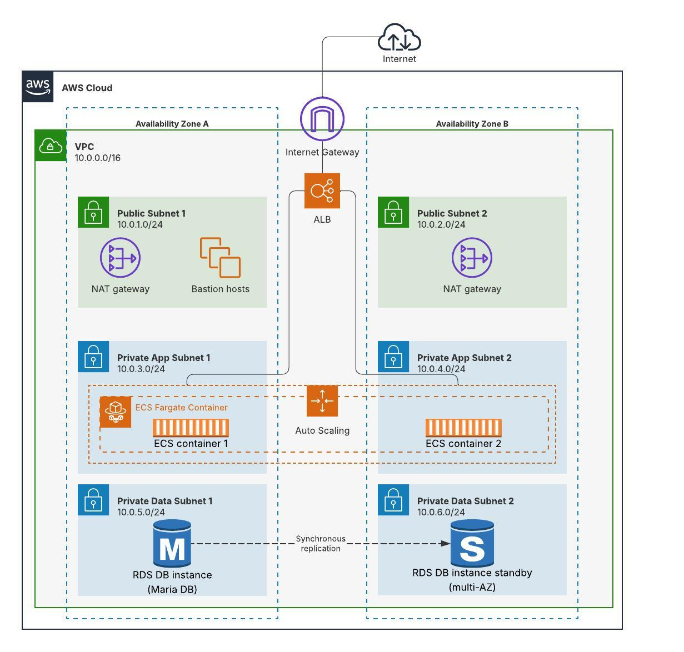

# Doctors App Infrastructure (Terraform)

This repository contains Terraform code that builds a **highly available AWS architecture** for the Doctors App. The deployment includes VPC networking, ECS Fargate containers, an Application Load Balancer, NAT gateways, a Bastion host, and a Multi‑AZ MariaDB RDS instance.

---

## 📌 Architecture Overview

The Terraform code in this repository deploys the following infrastructure:

* **VPC** (10.0.0.0/16)
* **Public Subnets** (per AZ)

  * NAT Gateways
  * Bastion Host
* **Private App Subnets** (for ECS Fargate)
* **Private Data Subnets** (for RDS MariaDB)
* **Application Load Balancer (ALB)**
* **ECS Fargate Cluster & Services** with auto scaling
* **RDS MariaDB (Multi‑AZ)** with synchronous replication to standby

### Architecture Diagram

### Architecture Diagram

Add this image to your repo root as `architecture.jpeg` and Markdown will display it:

```md

```

---

## 🛠️ Prerequisites

Before running Terraform, you **must create**:

### 1. **SSH Key for Bastion Access**

Create your SSH key and place it inside the `keys/` directory:

```bash
ssh-keygen -t rsa -b 4096 -f ~/.ssh/edoc_bastion -N ""
```

### 2. **S3 Backend for Terraform State**

Create an S3 bucket manually (example):

```
edoc-doctorsapp-tfstate
```

### 3. **DynamoDB Table for State Locking**

Create a table manually:

* **Table name:** `terraform-locks`
* **Partition key:** `LockID` (String)

Update backend configuration in Terraform to match your resources.

---

## 🚀 Deploying the Infrastructure

Run Terraform commands:

```bash
terraform init
terraform plan
terraform apply
```

---

# 🔐 Connecting to the Bastion Host

After Terraform outputs the bastion public IP, SSH into it:

```bash
ssh -i ~/.ssh/edoc_bastion ubuntu@<BASTION_PUBLIC_IP>
```

Upload your SQL file to the bastion:

```bash
scp -i ~/.ssh/edoc_bastion ./edoc.sql ubuntu@<BASTION_PUBLIC_IP>:/home/ubuntu/edoc.sql
```

---

# 🗄️ Import Database Into RDS

From inside the Bastion host:

```bash
mysql -h <rds-endpoint> -u user -p edoc < /home/ubuntu/edoc.sql
```

Check that tables exist:

```bash
mysql -h <rds-endpoint> -u user -p -e "SHOW TABLES;" edoc
```

---

## 📂 Repository Structure

```
root
├── main.tf
├── vpc/
├── ecs/
├── rds/
├── outputs.tf
├── variables.tf
├── keys/        # Place SSH key here
└── README.md
```

---

## 📝 Notes

* Make sure your IP is allowed in the Bastion security group.
* ECS tasks run in private subnets and do **not** have public IPs.
* RDS is fully private and only reachable through the Bastion.

